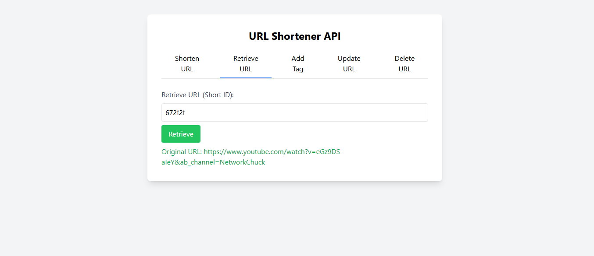

# GoTinyURL - URL Shortener

This project is a simple URL shortener application that provides an interactive UI for shortening, retrieving, updating, tagging, and deleting URLs. The application runs through Docker Compose and serves the frontend using Live Server.

## Repository

GitHub Repository: [GoTinyURL](https://github.com/nomankhokhar/GoTinyURL)

## Prerequisites

Ensure you have the following installed on your machine:

- [Docker](https://www.docker.com/get-started)
- [Docker Compose](https://docs.docker.com/compose/install/)

## Getting Started

### 1. Clone the Repository

```sh
git clone https://github.com/nomankhokhar/GoTinyURL.git
cd GoTinyURL
```

### 2. Run the Application using Docker Compose

```sh
docker-compose up -d
```

This will start the required services, including the backend API and frontend UI.

### 3. Access the Application

- Open your browser and navigate to:
  ```sh
  http://localhost:5500/index.html
  ```
  This will serve the frontend using Live Server.

## Stopping the Application

To stop the services, run:

```sh
docker-compose down
```

## Authors

- [@nomankhokhar](https://www.github.com/nomankhokhar)

## Badges

[](https://choosealicense.com/licenses/mit/)

## 🚀 About Me

I'm a full Stack Developer...
